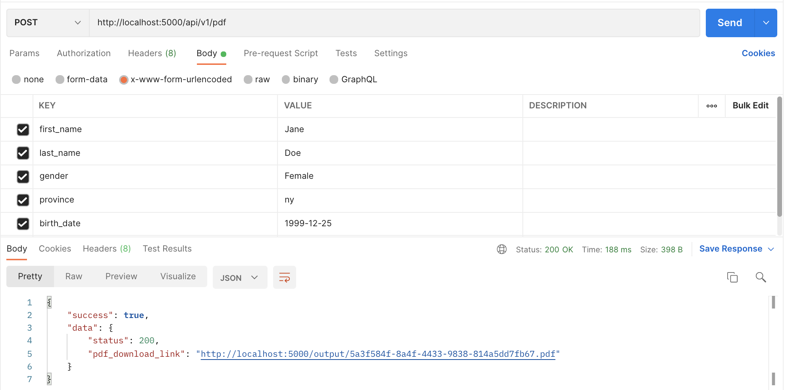

# PDF_Autofill

Automatically fill out PDF forms and skip the cumbersome and tedious process to manually fill them.

## Description

Today companies are simplifying and automating the modern-day business administration. These administrative processes are cumbersome and often involve a lot of manual (and error-prone!) work. One particularly tedious aspect is the need to fill out PDF forms based on the department workflow.

## Getting Started

### Dependencies

* body-parser
* cors
* express
* moment-timezone
* morgan
* pdf-lib
* uuid

### Prerequisites

The app requires NodeJS and NPM to be installed on the system where this application will run.

* Verify if NodeJS and NPM is already installed on your system by executing following commands from the terminal. If installed then it will output the version number.

  ```sh
  node --version
  ```

  ```sh
  npm --version
  ```

* Otherwise, download and install NodeJS v15.0.0 from https://nodejs.org/download/release/v15.0.0/ based on your system OS. This will also install NPM by default along with NodeJS.

### Installing

1. Clone the repo
   ```sh
   git clone https://github.com/jaspal-carleton/pdf_autofill.git
   ```

2. Change directory to the project folder
   ```sh
   cd pdf_autofill
   ```

3. Change directory to the server folder
   ```sh
   cd server
   ```

4. Install NodeJS modules or packages
   ```sh
   npm install
   ```

### Executing program

1. Run the app by executing following npm command from inside the project's server folder
   ```sh
   npm start
   ```

## Usage

To test the functionality of backend server to automatically fill the PDF form details, you need to make an HTTP POST request with the object body containing attributes as described below.

### Supported APIs

| Endpoint        | Request | API-URL                             | Description                                    |
|-----------------|---------|-------------------------------------|------------------------------------------------|
| /api/v1/pdf     | POST    | http://localhost:5000/api/v1/pdf    | Create new PDF as per HTTP POST body form data |

### Schema of HTTP POST Request Body Object

```JS
{
    "first_name": "<first name of the doctor>",
    "last_name": "<last name of the doctor>",
    "gender": "<gender of the doctor>",
    "province": "<ISO province code>",
    "birth_date": "<birth date of the doctor>"
}
```

Example
```JS
{
    "first_name": "Jane",
    "last_name": "Doe",
    "gender": "Female",
    "province": "NY",
    "birth_date": "1989-12-25"
}
```

### Data Type and Value Constraints

* Following constraints apply to HTTP POST Request Body Object

| Attribute     | Data Type | Constraint                                          |
|---------------|-----------|-----------------------------------------------------|
| first_name    | String    | Valid Unicode string with more than one characters  |
| last_name     | String    | Valid Unicode string with more than one characters  |
| gender        | String    | Male or Female                                      |
| province      | String    | ISO standard USA province code                      |
| birth_date    | String    | Date in YYYY-MM-DD format                           |

### Response Object

* Sample Success response after creating new pdf

```JS
{
    "success": true,
    "data": {
        "status": 200,
        "pdf_download_link": "http://localhost:5000/output/5a3f584f-8a4f-4433-9838-814a5dd7fb67.pdf"
    }
}
```

### Example: Using Postman App making HTTP POST Request



## Output PDF

The output PDF file generated after autofill process can be found under the following folder. 
   ```sh
   ../server/output
   ```

## Author

Jaspal Singh

Project Link: https://github.com/jaspal-carleton/pdf_autofill

## License

This project is licensed under the MIT License - see the LICENSE file for details
